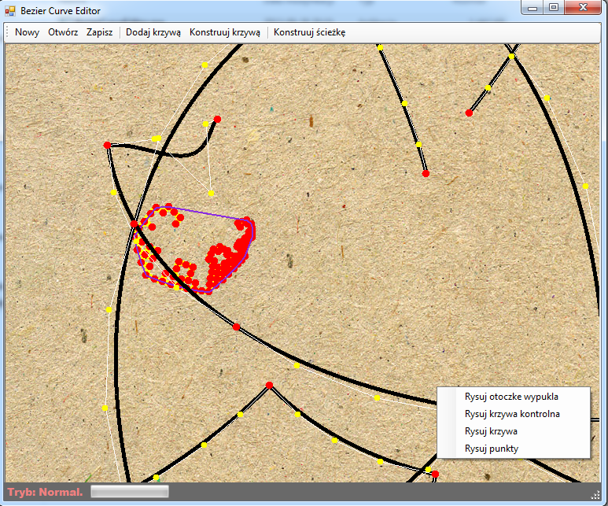

Bezier Curve Editor
====

Unfinished project - Bezier Curve Editor, done in C#. It's not bug free and I'm not satisfied with quality of code (mostly due deadlines so I coded instead of think first). 
I'm going to reimplement it from scratch.
 
Features:
- can draw simple bezier curve or merged sequence (with C1 continuity)
- can show convex hull, points and lines, can freely move control points
- can freely increase degree of curve without changing it shape
- can decrease degree and algorithm will do the best to not affect shape
- fractalize bezier curve using complex components and castelijou algorithm

